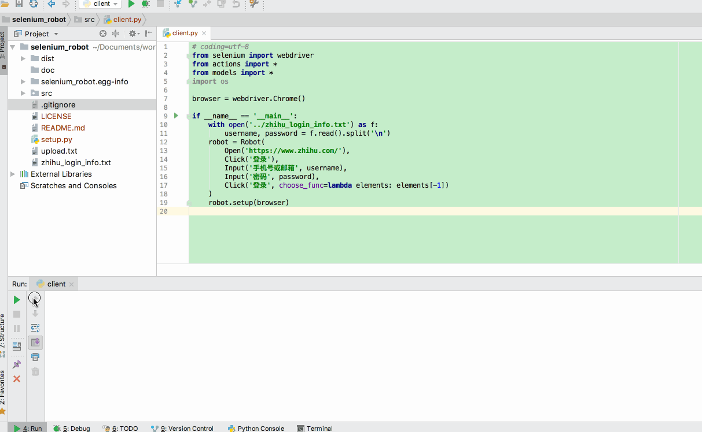

# selenium-robot
*基于selenium框架的robot封装，支持快速生成浏览器自动化脚本*

### 快速开始

```Python
robot = Robot(
    Open('https://www.zhihu.com/'),
    Click('登录'),
    Input('手机号或邮箱', username),
    Input('密码', password),
    Click('登录', choose_func=lambda elements: elements[-1])
)
robot.setup(browser)
```


运行效果图



